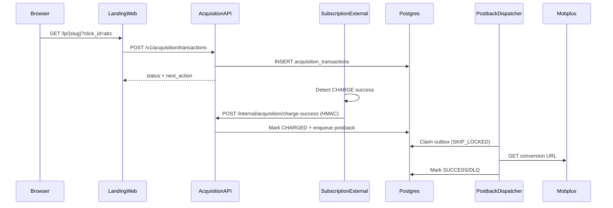

# Web Acquisition & Mobplus Postback Guide

This document describes how to configure and operate the web acquisition system with Mobplus conversion postbacks.

## Overview

The acquisition system handles:
1. **Landing page** (`landing-web`) → captures MSISDN + click attribution
2. **Acquisition API** (`acquisition-api`) → processes subscription + stores transaction
3. **Postback Dispatcher** (`postback-dispatcher`) → sends conversion postbacks to ad partners
4. **Subscription External** (`subscription-external`) → notifies acquisition-api on charge success



## Configuration

### Environment Variables

#### acquisition-api
```bash
# Required secrets
TIMWE_API_KEY=your-timwe-api-key
TIMWE_PSK=your-timwe-psk
DB_PASSWORD=your-db-password
INTERNAL_API_SECRET=your-internal-api-secret  # For charge-success endpoint

# Optional overrides
DATABASE_POSTGRESQL_HOST=localhost
DATABASE_POSTGRESQL_PORT=5432
```

#### subscription-external
```bash
# Required for charge callback
ACQUISITION_API_URL=http://acquisition-api:8084  # Internal service URL
INTERNAL_API_SECRET=your-internal-api-secret     # Must match acquisition-api

# Optional: disable charge callback (for testing)
ACQUISITION_CHARGE_CALLBACK_ENABLED=true
```

## Internal Auth Contract

The `/internal/acquisition/charge-success` endpoint uses HMAC authentication:

### Request Headers
```
X-Internal-Timestamp: RFC3339 timestamp (e.g., 2026-01-11T10:30:00Z)
X-Internal-Signature: hex(HMAC-SHA256(secret, timestamp + body))
Content-Type: application/json
```

### Request Body
```json
{
    "timwe_transaction_id": "uuid-from-timwe-notification",
    "msisdn": "233xxxxxxxxx",
    "product_id": 8509,
    "charged_at": "2026-01-11T10:30:00Z",
    "payout": "5.00"
}
```

### Response
- `200 OK`: Success (postback enqueued)
- `404 Not Found`: Transaction not found (non-web acquisition, ignored)
- `401 Unauthorized`: Invalid signature
- `400 Bad Request`: Invalid payload

## Postback Rules Configuration

Postback rules are stored in the `campaigns.postback_rules` JSONB column.

### JSON Structure
```json
{
    "conversion": {
        "mobplus": {
            "method": "GET",
            "url": "http://m.mobplus.net/c/p/CAMPAIGN_KEY?txid={click_id}"
        }
    },
    "subscribed": {
        "generic": {
            "method": "POST",
            "url": "https://your-tracker.com/postback",
            "headers": {"Authorization": "Bearer xyz"},
            "body": {"click_id": "{click_id}", "event": "{event}"}
        }
    }
}
```

### Available Template Variables
| Variable | Description |
|----------|-------------|
| `{click_id}` | Ad click ID from landing page |
| `{transaction_id}` | Acquisition transaction UUID |
| `{campaign_slug}` | Campaign identifier |
| `{msisdn_hash}` | SHA256 hash of MSISDN |
| `{payout}` | Charge amount (if available) |
| `{event}` | Event type (conversion, subscribed) |

### Event Types
- **conversion**: Triggered on successful charge (charge-gated)
- **subscribed**: Triggered on subscription (not recommended for Mobplus)

## Attribution Mapping

Maps incoming URL parameters to canonical fields:

```json
{
    "click_id": "click_id",
    "txid": "click_id",
    "clickid": "click_id",
    "cid": "click_id",
    "subid": "click_id",
    "sub1": "sub1",
    "sub2": "sub2",
    "sub3": "sub3"
}
```

### Landing Page URL Example
```
https://landing.example.com/lp/gh-tigo-mobplus-daily?txid=ABC123&sub1=campaign1
```

## Database Setup

### Run Migrations
```bash
# Apply schema (subscription-external migrations include campaign tables)
psql $DATABASE_URL -f services/subscription-external/migrations/006_web_acquisition_campaigns.sql
psql $DATABASE_URL -f services/subscription-external/migrations/007_add_charge_tracking_columns.sql

# Seed example campaigns
psql $DATABASE_URL -f services/acquisition-api/migrations/seed_campaign.sql
```

### Update Campaign Postback URL
```sql
UPDATE campaigns
SET postback_rules = '{
    "conversion": {
        "mobplus": {
            "method": "GET",
            "url": "http://m.mobplus.net/c/p/YOUR_ACTUAL_KEY?txid={click_id}"
        }
    }
}'::jsonb
WHERE slug = 'gh-tigo-mobplus-daily';
```

## Testing Flow

### 1. Test Landing Page
```bash
curl "http://localhost:3000/lp/test-campaign?click_id=TEST123&sub1=test"
```

### 2. Verify Transaction Created
```sql
SELECT id, campaign_slug, click_id, status, created_at
FROM acquisition_transactions
WHERE click_id = 'TEST123';
```

### 3. Simulate Charge Success (Internal)
```bash
# Generate signature
TIMESTAMP=$(date -u +"%Y-%m-%dT%H:%M:%SZ")
BODY='{"timwe_transaction_id":"<txid>","msisdn":"233123456789","payout":"5.00"}'
SIGNATURE=$(echo -n "${TIMESTAMP}${BODY}" | openssl dgst -sha256 -hmac "$INTERNAL_API_SECRET" | awk '{print $2}')

curl -X POST "http://localhost:8084/internal/acquisition/charge-success" \
    -H "Content-Type: application/json" \
    -H "X-Internal-Timestamp: $TIMESTAMP" \
    -H "X-Internal-Signature: $SIGNATURE" \
    -d "$BODY"
```

### 4. Check Postback Queue
```sql
SELECT id, event, provider, status, attempt_count, url_template_rendered
FROM postback_outbox
WHERE transaction_id = '<transaction-uuid>'
ORDER BY created_at DESC;
```

## Troubleshooting

### Postback Not Sent
1. Check `postback_outbox` table for status
2. Verify `postback_rules` is correctly configured in campaign
3. Check `conversion_postback_sent` flag on transaction

### Charge Callback Not Working
1. Verify `ACQUISITION_API_URL` environment variable in subscription-external
2. Check `INTERNAL_API_SECRET` matches between services
3. Look for errors in subscription-external logs for webhook handler

### TIMWE Config Empty
1. Ensure `config.yaml` uses `TIMWE_MA` key (not `TIMWE`)
2. Verify `TIMWE_API_KEY` and `TIMWE_PSK` environment variables are set
